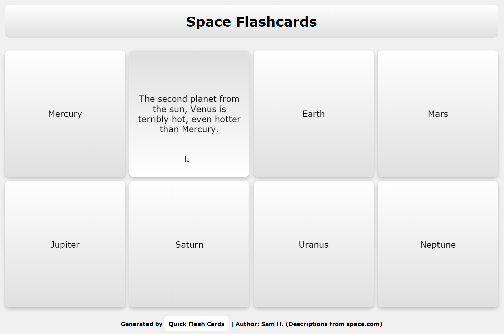

# Quick Flash Cards


>###### Static flashcard generator



## Installation

Requires Python 3.7, jinja2

```sh
pip install -r requirements.txt
```

## Usage example
Edit the flashcard data in 'cards_data.txt' and run:
```sh
python flashcards.py
```
the flashcards will be generated in the 'html' folder and your browser will open this file automatically.

You can edit additional settings in flashcards.py

## Development setup

Install the requirements as listed above and run the file directly.

```sh
python flashcards.py
```

## Release History

* 0.0.1
    * First release, work in progress

## Meta

Sam H. – [@shuff_co](https://twitter.com/shuff_co) – syfenx@gmail.com

[https://github.com/syfenx/](https://github.com/syfenx/)

## Contributing

1. Fork it (<https://github.com/syfenx/Quick-Flash-Cards/fork>)
2. Create your feature branch (`git checkout -b feature/fooBar`)
3. Commit your changes (`git commit -am 'Add some fooBar'`)
4. Push to the branch (`git push origin feature/fooBar`)
5. Create a new Pull Request